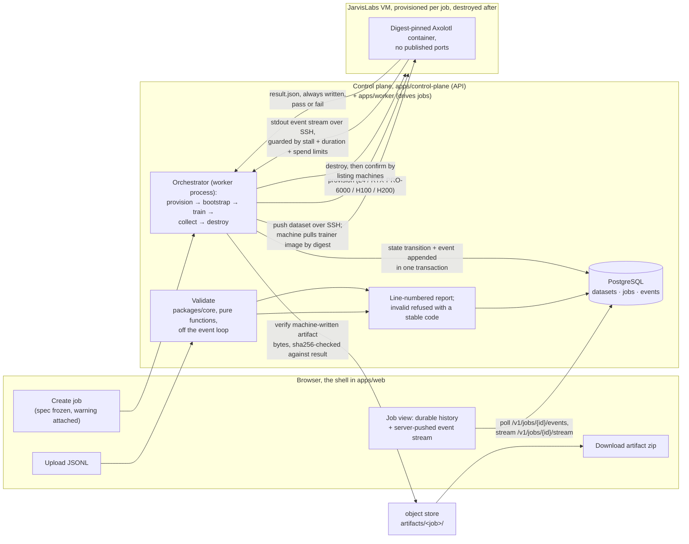

# Temper

A fine-tuning platform. Upload a dataset, pick a base model, get a trained artifact you can actually use.

> You don't reforge steel to change its properties, you temper it. Controlled, and the base material survives.
> That is QLoRA: the base weights stay frozen, a small adapter carries the change.

Compute defaults to [JarvisLabs](https://jarvislabs.ai) VMs, swappable behind the provider seam.

## What it does

Fine-tunes open-weight LLMs on instruction data, on real GPUs. Dataset in, artifact out.

The whole journey runs from a browser, in the application shell in
[`apps/web`](apps/web/). Upload a dataset, validate it, pick a model,
review the plan, watch the job over a live event stream, download the
artifact. The worker destroys the machine afterwards and confirms it gone.
The shell's client comes from the API's published contract, and it is the
only interface. The same journey works over the API directly. Cancellation
and the runaway-job limits hold suite-wide against a stubbed provider, and
held on real runs during the build.

### What's out of scope

Named here so you don't have to find each one yourself.

- Auth and billing. Everything else is meant to be complete.
- Invoiced costs. A creation-time warning flags datasets that won't fit the job ceiling, and `/v1/quotes` ranges time and cost per phase. Both are estimates. Nothing reads an invoice.
- Persistent serving. You download the artifact. A finished job's model gets a temporary endpoint that stops itself, for evaluation only.
- Uncurated models. Two pinned models in the catalog, anything else through a compatibility probe. Datasets arrive as uploads or Hugging Face imports, validated the same way.
- The rest of the Phase B stack. Temporal and Redis are specified ([docs/specs/](docs/specs/)) and not built. The object store is an S3-compatible seam, filesystem by default. Postgres is done, behind the same functions, migrations versioned ([issue #43](docs/adr/0064-the-relational-store-moves-behind-the-existing-seam.md)). The worker claims queued jobs outside the request path. The shell ([Spec 007](docs/specs/007-the-application-shell.md)) is done: Next.js, generated client, the only interface.

### What it runs

**Method.** SFT picked by the predictor, overridable. QLoRA by default (NF4, bf16, rank 16, alpha 32, all linear layers), full fine-tuning since issue #66. Adapters ship fp32, so a 4B adapter is 132 MB, not 66 ([ADR-0008](docs/adr/0008-adapters-ship-as-fp32.md)). The predictor buys the cheapest setup that fits and breaks ties toward the stronger method. Both methods are documented in [apps/trainer/README.md](apps/trainer/README.md).

**Models.** `Qwen/Qwen3-4B` and `Qwen/Qwen3-8B`, pinned revisions, Apache-2.0.

**Compute.** JarvisLabs VMs. One per job, destroyed after.

**Trainer.** Axolotl, digest-pinned.

**Dataset limit.** 5 GB by default (`TEMPER_MAX_DATASET_MB`). Validation streams, so the cap is a throughput rule, not a memory ceiling ([ADR-0036](docs/adr/0036-the-dataset-size-limit-is-derived-from-measured-throughput.md)). Over it gets a 413 naming both sizes.

**Warning and quote.** A dataset that won't fit the 24-hour ceiling (`TEMPER_MAX_JOB_DURATION_S`) warns at creation. `/v1/quotes` ranges time and cost per phase, frozen into the job spec. Estimates, both. The job launches anyway ([spec 005](docs/specs/005-predictor-and-quote.md)).

## Architecture

Dataset to artifact, as it runs today:



## Why these choices

Each one names the options that lost, because a decision you can't explain is one you didn't make. [docs/adr/](docs/adr/) holds them. Three examples:

**All linear layers, not attention-only.** The MLP is most of every transformer block, and no rank makes up for leaving it out. The evidence, including the "LoRA Without Regret" result, is in [report A](docs/research-reports/report-a.md).

**Axolotl pinned by digest, not six packages by hand.** Owning the torch/transformers/TRL/PEFT matrix cost checkpoint-resume once. Delegating it to maintainers who test it daily fixed that. The full chain is in [apps/trainer/README.md](apps/trainer/README.md).

**Correctness settings locked by default, not hidden.** Template resolution, EOS handling, and loss masking fail silently, so they ship with correct values. Advanced mode still exposes each one with its failure mode named and records the override. Rule and reversal: [ADR-0040](docs/adr/0040-an-override-names-its-failure-mode-and-a-locked-setting-is-not-a-refused-input.md) and [spec 009](docs/specs/009-models-methods-and-advanced-mode.md).

## Running it

You need Docker with Compose and nothing else. Check `docker compose version` answers, then:

```
git clone https://github.com/thp728/temper.git
cd temper
docker compose up          # or: just up, if you have just
```

First run builds images, so give it a few minutes. Later runs start in seconds.

| What              | Where                                                   |
| ----------------- | ------------------------------------------------------- |
| Web shell         | http://localhost:5780                                   |
| Control plane API | http://localhost:5781 (`/docs` for the interactive API) |
| Health            | http://localhost:5781/health                            |

No configuration, no secrets, no account. One anchor in compose.yaml, `x-zero-cost-mode` (`TEMPER_FAKE_PROVIDER=1`), picks the zero-cost tier. Launched jobs run against the in-package simulated machine, so the whole journey costs nothing: upload, validate, pick, review, watch, download. `/health` names the tier (`provider: "fake"`) and reports database and object store separately, so a broken dependency reads as broken, not as a broken app.

First boot seeds a sample dataset and one finished run (`samples/sample-chat.jsonl`), so the job list has something to open before you upload anything. Every page in this tier carries a demonstration banner, driven by the same setting, and it stays on in that mode
([ADR-0071](docs/adr/0071-the-zero-cost-path-is-a-labelled-demonstration-structurally-blind-to-the-transport.md)).

**What the zero-cost tier can't prove.** The simulated machine never crosses a connection, so the tier is blind to transport defects. That bit us once: a line-ending translation on the way to the remote shell broke a real run
([ADR-0027](docs/adr/0027-the-transport-is-proven-against-a-real-endpoint.md)).
This tier proves the shape of the journey. It says nothing about reaching a real machine.

**Data survives a restart.** Postgres data and the object store live on named volumes:

```
docker compose down        # or: just down
docker compose up          # your datasets and jobs are still there
```

**Real compute is one switch.** Flip `x-zero-cost-mode` to `0` and put `JL_API_KEY=...` in `.env` at the repo root. The three app services read the one anchor, so provider and banner move together. A bare process with nothing set lands on the real tier with fault injection refused. That is the safe default, and the zero-cost stack can't touch real hardware or the billing account.

### The no-Docker path (development)

For working on the code. You need [uv](https://docs.astral.sh/uv/), [just](https://just.systems),
and Node 22 with corepack enabled. Every `just` recipe is one readable command if you'd rather skip `just`.

```
just setup     # resolve and install everything, one lockfile
just check     # format, lint, types, tests, contract drift. One pass or fail
just dev       # the control plane on localhost (port 8000), with reload
just dev-web   # the web shell, in a second terminal
just --list    # every task
```

Without credentials the control plane starts and datasets validate fine. Jobs fail at provisioning with the reason named.

### Real jobs, and the one trap worth naming

Real hardware needs a [JarvisLabs](https://jarvislabs.ai)
account: `JL_API_KEY`, a registered SSH key pair, and an agent holding the
key. `ssh-add -l` must list one before any GPU work. Boot checks what it can
and names the rest in the job's error record. One thing nothing checks.
On Windows, everything that SSHes must run through PowerShell, never Git Bash,
whose bundled `ssh` can't see the Windows agent and fails exactly like a dead machine.

## Layout

One rule: if it ships it is an app, if it is imported it is a package.

```
apps/
  control-plane/   the API: upload, validate, catalog, launch, watch, download
  web/             the application shell (Spec 007): a Next.js client generated
                   from the API contract. The only interface
  worker/          claims queued jobs and drives them (issue #51);
                   also hosts the machine-lifetime reconciler
  trainer/         the pinned training container and its /job -> /out contract
packages/
  core/            the domain: validation, hyperparameters, feasibility,
                   thinking-mode detection. No framework imports
  contracts/       artifacts crossing a boundary where import is impossible:
                   some generated (`openapi.json`), some hand-kept
                   (`trainer-defaults.json`)
spike/             infrastructure probes against the live JarvisLabs account
```

Recorded in [ADR-0010](docs/adr/0010-the-repository-is-laid-out-as-apps-and-packages.md),
with the flat alternative and why it lost.

## Known gaps

Named here so you don't trip over them. Current as of 2026-09-05.

- **Loss is a number and a curve.** Running and finished views draw training and held-out series, with a held-out plateau in plain words. The values come from real training output, promoted by a classifier checked line by line against it.
- **A finished job's page cuts the log.** Events cap at 500 and a real run writes more. Live watching polls past it. The finished page doesn't, but `after` pages through the full record.
- **The log is mostly build noise.** Several hundred events per run, mostly container-build progress, burying the trainer's own output.
- **Costs are derived, never invoiced.** Quotes estimate up front; every finished job records its derived actuals. The measured reference run is in [ADR-0021](docs/adr/0021-the-first-assembled-run-read-before-paid.md).
- **It has never been started anywhere but the author's machine,** which runs Windows. The one-command stack (`docker compose up`) is verified there, restarts included. The cold-clone test (fresh machine, fresh clone, one command, one real job) is in [spec 012](docs/specs/012-clone-and-run.md), because every big defect here came from running the assembled thing, not reasoning about it.

## License

[MIT](LICENSE), over Apache-2.0, GPL, and source-available, with the rejected options in [ADR-0012](docs/adr/0012-the-repository-ships-under-mit.md). Apache-2.0's patent grant covers a risk nothing here has, and costs a reader ten times the reading.

Adapters carry the base model's terms, not the repo's: both catalog models are Apache-2.0, and the catalog shows each model's licence beside its pinned revision at job creation.
