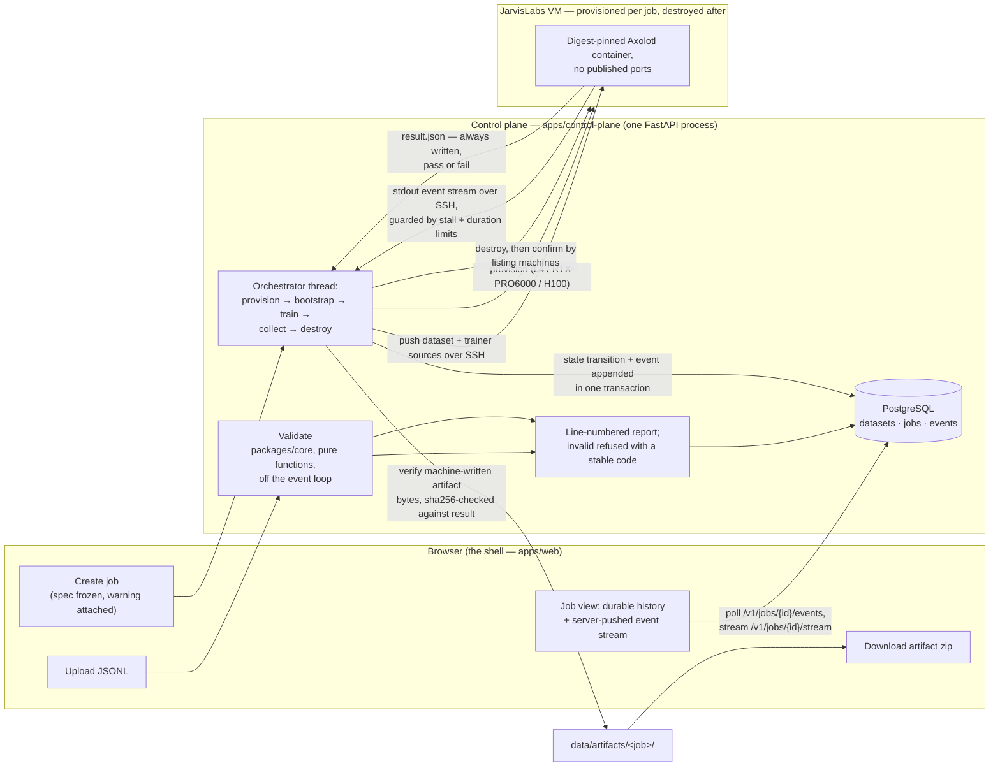

# Temper

A fine-tuning platform. Upload a dataset, pick a base model, get a trained artifact you can actually use.

> You don't reforge steel to change its properties — you temper it. Controlled, and the base material survives.
> That is QLoRA: the base weights stay frozen, a small adapter carries the change. Full fine-tuning is reforging.

Built as a take-home for [JarvisLabs.ai](https://jarvislabs.ai), August 2026, and made public at submission.

## What it does

Fine-tunes open-weight LLMs on user-supplied instruction data, on real GPUs, end to end — dataset in, artifact out.

**The whole journey runs from a browser**, in the application shell in
[`apps/web`](apps/web/): upload and validate a dataset, choose a base model,
review the plan, watch the run as it provisions and trains over a server-pushed
event stream, and download the artifact — with the machine destroyed afterwards
and confirmed gone. The shell's client is generated from the API's published
contract, and it is the only interface: the earlier server-rendered pages were
deleted when the last screen was ported (Spec 007). The same journey is
available over the API. Cancellation and the runaway-job limits are in place,
exercised suite-wide against a stubbed provider and on real runs during the
build.

**Deliberately absent** — stated here rather than left for a reader to notice:

- **Auth and billing**, which the brief sanctions cutting. Everything else is meant to be complete.
- **A pre-run cost quote.** A creation-time *warning* exists when a dataset plainly cannot finish inside the job ceiling; an actual price quote does not, and no code path reads an invoice.
- **An inference endpoint.** The delivered artifact is the trained adapter or model, not a served endpoint.
- **Imports from Hugging Face.** Models come from a curated, pinned catalog of two; datasets are uploaded files.
- **Streaming validation.** Measured at flat +4 MB memory from 1 GB to 20 GB, but not built — so uploads stay capped (see below).
- **The rest of the Phase B stack.** Temporal, Redis and MinIO are specified ([docs/specs/](docs/specs/)) and not built. Persistence moved to PostgreSQL, behind the same functions and with real versioned migrations ([issue #43](docs/adr/0064-the-relational-store-moves-behind-the-existing-seam.md)); everything else still runs as one FastAPI process and a thread per job — with the domain logic already extracted into `packages/core` so the migration is a seam-by-seam swap, not a rewrite. The application shell ([Spec 007](docs/specs/007-the-application-shell.md)) *is* built: a Next.js app whose client is generated from the API contract, replacing the Phase A server-rendered pages.

- **Method:** supervised fine-tuning, chosen by the predictor and overridable — **QLoRA** (NF4 double-quant base, bf16 compute, rank 16, α=32, **all linear layers**; the adapter ships fp32, which is what `prepare_model_for_kbit_training` does and is why a 4B adapter is 132 MB rather than ~66 MB) or **full fine-tuning** (issue #66: every weight trained in bf16, its own lower learning rate, the whole model delivered as one archive). The predictor picks the cheapest configuration that fits and prefers the more capable method at a tied price, with the reasoning against the alternative shown.
- **Models:** curated and pinned — `Qwen/Qwen3-4B`, `Qwen/Qwen3-8B`
- **Compute:** JarvisLabs VMs, provisioned and destroyed per job
- **Trainer:** Axolotl in a digest-pinned container
- **Dataset limit:** 1 GB per upload (`TEMPER_MAX_DATASET_MB`). This is a limit of the current in-memory validation path, which holds about **5.9× the file size** — not a product rule. (The figure was 4.8× until spike 9 measured it at a real 1 GB file rather than extrapolating from small ones; see [ADR-0005](docs/adr/0005-the-dataset-size-limit-is-derived-from-measured-memory.md).) Streaming validation removes the limit — measured at **flat +4 MB from 1 GB to 20 GB, and faster than the in-memory path** — but it is not built yet. Until then, uploads over the limit are refused immediately with both sizes named.
- **Duration warning:** a dataset that plainly cannot finish inside the 24-hour job ceiling (`TEMPER_MAX_JOB_DURATION_S`) gets a warning at job creation — an **estimate** from measured throughput on one real run (~1.19 row-passes/s, L4, Qwen3-4B), not a quote. The job launches anyway; the estimate is crude and only the user should decide whether the run is worth attempting.

## Architecture

Dataset through training to delivered artifact, as it actually runs today:



Every arrow above is a code path that ran for real during the build. What the diagram deliberately does not show: auth, tenants, queues, object storage — absent for the reasons listed above, not omitted from the drawing.

## Why these choices

Every one of them is written down with alternatives and tradeoffs, because a decision you cannot explain is not a decision you made. [docs/adr/](docs/adr/) holds the record; three examples:

**All linear layers, not attention-only.** In Qwen3-8B the MLP is **78.3%** of every transformer block's parameters. Attention-only LoRA reaches about 11% of each block — no rank compensates for the rest simply not being in the optimisation.

**Axolotl pinned by digest, rather than pinning six packages by hand.** Installing "latest" produced `transformers 5.15` + `trl 1.10` on `torch 2.5.1`: TRL 1.x dropped `warmup_ratio`, rejected `save_safetensors` so checkpoints wrote as torch `.bin`, and transformers 5.x then refused to load them without `torch >= 2.6`. **Training worked; resume was impossible.** Delegating that matrix to people who test it daily is the fix.

**Correctness settings are locked by default, not hidden.** Chat-template resolution, EOS handling and loss masking are the highest-frequency silent failure in this category — they pass every obvious health check and surface only as bad output — so they ship with correct values and no way to fumble them by accident. **They are not permanently sealed:** an Advanced mode exposes each with its failure mode named inline and records the override in the run spec, guarded by an export-time template probe. ⚠️ *This reverses an earlier position that they should never be user-settable — every serious platform in this space exposes them, and permanent hiding is a limitation wearing the costume of a safety feature.*

## Measured, not estimated

On an NVIDIA L4 (24 GB), Qwen3-4B:

| | |
| --- | --- |
| Peak VRAM | **5.31 GB** |
| Trainable parameters | **33,030,144** (predicted from `config.json`, confirmed by the run) |
| Cold start | **2–4 min** — 10–13s provision, 40–47s to SSH, **87–183s image pull** (same digest; the spread is registry throughput) |
| Checkpoint resume | verified |
| End-to-end job | **336s**, VM alive 363s, ≈**₹4.8** derived from provision-to-teardown |

⚠️ **Derived is not measured.** The cost line is computed from the event log against the stored hourly price; nothing here reads an invoice, and nothing in the product computes a job cost yet. Every number above is tagged measured or derived, and the same rule holds everywhere else in this repository.

## Running it

Written for someone who has never run this and is starting on a clean machine.

### The one command (recommended)

**Prerequisite: [Docker](https://www.docker.com/products/docker-desktop/) with
Compose.** Nothing else — not uv, not Node, not a compute account. Docker must
be installed and running; nothing in this repository can check that for you, so
verify `docker compose version` answers before the step below.

```
git clone https://github.com/thp728/temper.git
cd temper
docker compose up          # or: just up, if you have just
```

That builds two containers — the **control plane** (the API) and the **web
shell** (the interface) — and starts them. The first run builds images, so
give it a few minutes; every later run starts in seconds. When it is up:

| What | Where |
| --- | --- |
| Web shell | http://localhost:5780 |
| Control plane API | http://localhost:5781 (`/docs` for the interactive API) |
| Health | http://localhost:5781/health |

**Nothing is required of you — no configuration, no secrets, no account.**
The control plane image ships with only local defaults, and compose.yaml sets
exactly one value beyond them: `TEMPER_FAKE_PROVIDER=1`, which chooses the
**zero-cost tier**. On that tier launched jobs run against the in-package
simulated machine, so you can walk the whole journey — upload a dataset,
validate it, pick a model, review the plan, watch a run complete over a live
event stream, download the artifact — without spending anything. `/health`
says which tier is in force (`provider: "fake"`) and reports the database and
the object store **separately**, so a broken dependency reads as a broken
dependency, not as a broken application.

The stack starts ready to look at: on its first boot against an empty
database, the zero-cost tier seeds a sample dataset and one completed run
(`samples/sample-chat.jsonl`), so the job list already has a finished job to
open and download before you upload anything. And it says what it is: **every
page in this tier carries a demonstration banner**, driven by the same single
setting, and it cannot be turned off in that mode
([ADR-0071](docs/adr/0071-the-zero-cost-path-is-a-labelled-demonstration-structurally-blind-to-the-transport.md)).

**What the zero-cost tier cannot prove, named plainly.** The simulated machine
never crosses a connection — it implements the whole compute interface without
moving a byte over one — so the zero-cost tier is **structurally blind to
transport defects**. That is not a theoretical caution here: the defect that
broke a real run in this project was a transport defect, a line-ending
translation applied on the way to the remote shell
([ADR-0027](docs/adr/0027-the-transport-is-proven-against-a-real-endpoint.md)).
What this tier proves is the shape of the whole journey; what it cannot prove
is any claim about reaching and driving a real machine, which is why the real
tier below exists and why the transport tier exists as a separate proof.

**Data survives a restart.** Datasets, jobs and artifacts live on a named
volume, so stopping and bringing it back up preserves everything:

```
docker compose down        # or: just down
docker compose up          # your datasets and jobs are still there
```

**Real compute is one switch away.** The mode is defined once in `compose.yaml`
(the `x-zero-cost-mode` anchor near the top), and every service — control
plane, worker, web shell — reads that one value, so flipping it to `0` moves
the provider *and* the interface's demonstration marking together. Set it to
`0` and put `JL_API_KEY=...` in a `.env` file at the repo root. That is the
only thing that differs between the modes. (For
the record: a bare process with nothing set lands on the real tier with fault
injection refused — the safe default. The one-command stack's zero-cost tier
is an explicit, visible choice in compose.yaml, and it cannot reach real
hardware or the billing account.)

### The no-Docker path (development)

For working on the code rather than evaluating it:

**Prerequisites:** [uv](https://docs.astral.sh/uv/), [just](https://just.systems),
and Node 22 with corepack enabled. Each is a single-binary install; every `just`
recipe is one readable command if you would rather not install the second.

```
just setup     # resolve and install everything, one lockfile
just check     # format, lint, types, tests, contract drift. One pass or fail
just dev       # the control plane on localhost (port 8000), with reload
just dev-web   # the web shell, in a second terminal
just --list    # every task
```

Without credentials the control plane starts and datasets validate fine; jobs
fail at provisioning with the reason named.

### Real jobs, and the one trap worth naming

Running a job on real hardware needs a [JarvisLabs](https://jarvislabs.ai)
account: `JL_API_KEY`, a registered SSH key pair, and an SSH agent holding the
key (`ssh-add -l` must list one before any GPU work). The product checks what
it can at boot and says what is missing in the job's own error record; one
thing nothing can check for you is a Windows-only trap: everything that SSHes
must run through PowerShell, never Git Bash, whose bundled `ssh` cannot see the
Windows agent and fails in a way that looks exactly like a dead machine.

## Layout

One rule: if it ships it is an app, if it is imported it is a package.

```
apps/
  control-plane/   the API: upload, validate, catalog, launch, watch, download
  web/             the application shell (Spec 007): a Next.js client generated
                   from the API contract. The only interface
  worker/          reserved for orchestration (#51). Empty on purpose
  trainer/         the pinned training container and its /job -> /out contract
packages/
  core/            the domain: validation, hyperparameters, feasibility,
                   thinking-mode detection. No framework imports, no I/O
  contracts/       generated artifacts crossing a language boundary
spike/             infrastructure probes against the live JarvisLabs account
```

Recorded in [ADR-0010](docs/adr/0010-the-repository-is-laid-out-as-apps-and-packages.md),
with the flat alternative and why it lost.

## Known gaps

Named here rather than left for a reader to find. Current as of 2026-08-28.

- **Loss reaches the page as a number, not a curve.** The job view shows the latest loss and step; a chart is being added to it this wave. The values themselves come from a real run's training output, promoted by a classifier that was checked line by line against that output.
- **A finished job's page truncates its log.** The event read caps at 500, and a real run writes more than that, so a finished job's page cuts off before its own final events. Live watching polls past the cap; the finished page does not.
- **The job log is mostly build noise.** A real run writes several hundred events, the large majority of them container-build progress, which buries the trainer's own output.
- **Costs are derived, never invoiced.** See the note above.
- **It has never been started anywhere but the author's machine,** which runs Windows. The one-command stack (`docker compose up`) now exists and is verified here, including that a restart preserves data; the cold-clone test — fresh machine, fresh clone, one command, one real job — is specified in [spec 012](docs/specs/012-clone-and-run.md) and scheduled before submission, because every significant defect in this project was found by running the assembled thing rather than reasoning about it.

## License

[MIT](LICENSE) — chosen over Apache-2.0, GPL and source-available, and recorded with the rejected alternatives in [ADR-0012](docs/adr/0012-the-repository-ships-under-mit.md). Apache-2.0's patent grant was the reason to prefer it and does not hold up here: nothing in this repository is patentable subject matter anyone is plausibly asserting, so the grant insures a risk that does not exist and costs an evaluator ten times the reading.

Separate from this repository's own licence: adapters produced here carry the **base model's** terms, since the weights they modify are Qwen3's. Both catalog models are Apache-2.0, and the catalog surfaces each model's licence beside its pinned revision at job creation.
